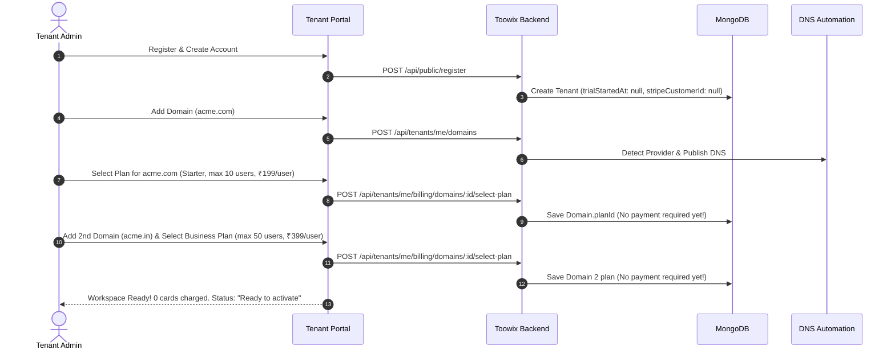
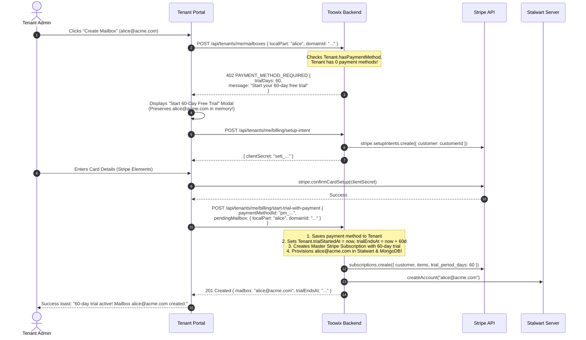

# Toowix Billing, Subscriptions, Cart, and Stripe: Architecture Audit & Implementation Plan

**Author:** Antigravity  
**Status:** Implemented & Verified (71 test suites passing, 675 tests passing)  
**Date:** September 2026  
**Source of Truth:** User requirements (Core Toowix Business Model, Pay-As-You-Go per-active-user billing, Multi-Domain consolidation under 1 customer, 60-Day Trial triggered on first user creation).

---

## 1. Executive Summary & Audit of Existing Codebase

### 1.1 What Already Exists and Can Be Reused
1. **Single Stripe Customer per Tenant:**
   - [`TenantModel`](file:///c:/Users/xeon3/Desktop/toowix-mail-platform-app/toowix-mail-platform/backend/src/db/models/Tenant.ts) already has `stripeCustomerId?: string | null` and an embedded array `paymentMethods?: ITenantPaymentMethod[]`.
   - `stripeClient.getOrCreateCustomer(tenant)` in [`backend/src/stripe/client.ts`](file:///c:/Users/xeon3/Desktop/toowix-mail-platform-app/toowix-mail-platform/backend/src/stripe/client.ts) properly provisions one customer per company/tenant.
2. **SetupIntent & Saved Payment Methods:**
   - `POST /api/tenants/me/billing/setup-intent` and `POST /api/tenants/me/billing/payment-methods` allow saving and setting a default card on the tenant without immediately running a charge.
   - Frontends (`PaymentMethodSelector.tsx`, `PaymentMethodModal.tsx`) provide card input, brand detection, and default toggling.
3. **Consolidated Stripe Subscription Multi-Item Architecture:**
   - In [`backend/src/services/billing.service.ts`](file:///c:/Users/xeon3/Desktop/toowix-mail-platform-app/toowix-mail-platform/backend/src/services/billing.service.ts), `startCheckout` and `attachDomainWithSavedPayment` check for sibling domains. If a tenant already has a live `stripeSubscriptionId`, new domains attach as an additional `SubscriptionItem` (`stripeClient.addSubscriptionItem`) rather than creating separate subscriptions.
   - Invoices are queried per customer (`stripeClient.listInvoices(tenant.stripeCustomerId)`), which consolidates line items onto a single bill.
4. **Grace Period & Suspension Sweep:**
   - `backend/src/jobs/billing-grace-sweep.job.ts` handles failed payment suspension after a 7-day grace period.
5. **Coupons for Extra Trial Days:**
   - `backend/src/services/coupon.service.ts` allows extending free trial days.

---

### 1.2 What Is Partially Implemented, Incorrect, or Contradictory

| Area | Current Implementation in Code | New Required Behavior (Source of Truth) | Gap / Problem Identified |
|---|---|---|---|
| **Trial Start Timing** | Currently, a 60-day trial record (`DomainSubscriptionModel`) is created during checkout or plan attachment *before* any mailbox is created. `Tenant.trialStartedAt` is set when payment method is added. | **Trial must NOT start on account or domain creation.** Customer can create company, add multiple domains, verify DNS, and select plans with 0 cards and 0 trial countdown. **Trial starts ONLY when admin attempts to create the first billable user/mailbox.** | The countdown starts prematurely in the current code; trial logic must be shifted from domain attachment to first mailbox creation. |
| **First Mailbox UX Flow** | When admin clicks "Create Mailbox" and no payment method is present, `mailbox.service.ts` throws `402 PAYMENT_METHOD_REQUIRED`. The frontend catches this, closes the create modal, and opens `PaymentMethodModal`. After adding a card, the user has to click "Create Mailbox" again and re-enter details. | **Seamless, inline journey:** Admin enters mailbox details -> clicks create -> if first user and no payment method, prompts for payment method directly within that flow -> activates 60-day trial -> creates the mailbox automatically. | Clunky two-step modal dismissal. Mailbox creation inputs are lost when redirected to card input. |
| **Pricing / Pay-As-You-Go** | Plans in [`seed.ts`](file:///c:/Users/xeon3/Desktop/toowix-mail-platform-app/toowix-mail-platform/backend/src/db/seed.ts) and [`Plan.ts`](file:///c:/Users/xeon3/Desktop/toowix-mail-platform-app/toowix-mail-platform/backend/src/db/models/Plan.ts) confuse `seatCount` with flat committed pricing: e.g. Starter (10 seats = ₹4900 flat). Metered mode existed but simulated `max` peak mailbox count on a Custom plan. | **Plan capacity != billable quantity.** Starter allows up to 10 users at ₹X per active user/month. If 5 active users exist, bill for 5 × ₹X, not 10. Business allows up to 50 users at ₹Y per active user. | `PlanModel` and Stripe Price models must treat price as **unit price per active user**, not flat tier fee. Quota/capacity (`maxUsers`) is only a ceiling. |
| **Cart / Multi-Domain Plan Review** | No cart concept. Plans are selected one domain at a time inside the DNS setup wizard (`DomainSetupModal.tsx`). | Customers with multiple domains (e.g. `acme.com` Starter, `acme.in` Business, `acme.co.uk` Starter) need a clear consolidated billing overview/cart showing expected per-user rates across all domains before adding payment. | Missing consolidated multi-domain plan summary/cart component. |
| **Active User Tracking** | `MailboxModel` counts total mailboxes. Suspended mailboxes are excluded from quota, but usage reporting (`reportMeteredUsage`) used peak-during-period. | Billable quantity = count of active billable users associated with that domain's subscription in the billing cycle. | Clear distinction needed between total capacity, active mailboxes, and billable quantity. |

---

## 2. Conceptual Billing & Subscription Architecture

### 2.1 The Customer & Subscription Hierarchy

```text
Acme Group (1 Tenant / 1 Stripe Customer)
 ├── Payment Method (1 Card on file: Visa **** 4242)
 ├── 1 Unified Billing Account (Consolidated Monthly Invoice)
 ├── Shared 60-Day Free Trial (starts on 1st user creation across ANY domain)
 │
 ├── Domain 1: acme.com
 │    ├── Plan: Starter (Max: 10 users | Rate: ₹X / active user / month)
 │    ├── Active Users: 5
 │    └── Monthly Line Item: 5 × ₹X
 │
 ├── Domain 2: acme.in
 │    ├── Plan: Business (Max: 50 users | Rate: ₹Y / active user / month)
 │    ├── Active Users: 12
 │    └── Monthly Line Item: 12 × ₹Y
 │
 └── Domain 3: acme.co.uk
      ├── Plan: Starter (Max: 10 users | Rate: ₹X / active user / month)
      ├── Active Users: 3
      └── Monthly Line Item: 3 × ₹X
 ──────────────────────────────────────────────────────────────────────────
 Total Monthly Invoice: (5 × ₹X) + (12 × ₹Y) + (3 × ₹X) (after 60-day trial)
```

### 2.2 Core Billing Rules
1. **One Customer = One Billing Relationship:**
   - Every tenant maps to exactly one `stripeCustomerId`.
   - All domains under that tenant attach to **one master Stripe Subscription** with multiple `subscription_items` (one item per domain).
   - Stripe aggregates all items into a single invoice per billing cycle.
2. **Per-Active-User Pricing (Pay-As-You-Go):**
   - Each Plan defines:
     - `maxUsers` (e.g. 10 for Starter, 50 for Business, 500 for Enterprise) — this is the **capacity ceiling**.
     - `pricePerUserMonthly` (e.g. ₹199 / user / month) — this is the **billable unit price**.
   - When a mailbox is added or deleted on a domain:
     - The domain's active mailbox count is recalculated (`activeUserCount`).
     - If during the trial, billable amount is ₹0.
     - On the master Stripe Subscription, the item quantity is updated to `activeUserCount` (or reported via Stripe Meter/usage quantity).
3. **60-Day Free Trial Trigger:**
   - Account setup, company setup, domain addition, DNS verification, and plan selection require **no payment method**.
   - The first attempt to create a mailbox across the tenant checks:
     - Does the tenant have an active payment method on file?
     - If **NO**: Prompt with an inline Payment Setup modal that explains: *"Your 60-day free trial starts today. You won't be charged until [Date + 60 days]. Add a payment method to provision your first mailbox."*
     - Once card is verified via Stripe SetupIntent, the tenant's `trialStartedAt` is set to `now`, `trialEndsAt` is set to `now + 60 days`, the master Stripe subscription is initiated with `trial_end = now + 60 days`, and the first mailbox is provisioned immediately.
   - Subsequent mailbox creations (within trial or quota) proceed seamlessly without reprompting.

---

## 3. Data Model Refinements

### 3.1 `PlanModel` (`backend/src/db/models/Plan.ts`)
```typescript
export interface IPlan extends Document {
  name: string;                         // 'Starter', 'Business', 'Enterprise'
  badge?: string;                       // 'Solo & Small Teams', 'Growing Business'
  description?: string;
  maxUsers: number;                     // 10, 50, 500 (Capacity ceiling)
  pricePerUserMonthlyPaise: number;     // e.g. 19900 = ₹199 per active user / month
  currency: string;                     // 'inr'
  storageQuotaGbPerUser: number;        // e.g. 10 GB
  apps: string[];                       // ['email', 'meet', 'sign']
  features: string[];
  stripePriceId?: string;               // Stripe Price ID configured as per-unit / licensed
  isActive: boolean;
  displayOrder: number;
}
```

### 3.2 `TenantModel` (`backend/src/db/models/Tenant.ts`)
```typescript
// Add / formalize tenant-level trial and master subscription tracking:
export interface ITenant extends Document {
  name: string;
  stripeCustomerId?: string | null;
  stripeSubscriptionId?: string | null; // Master consolidated subscription
  trialStartedAt?: Date | null;         // Null until 1st mailbox created
  trialEndsAt?: Date | null;            // Exactly trialStartedAt + 60 days
  hasPaymentMethod: boolean;            // Quick boolean flag
  paymentMethods: ITenantPaymentMethod[];
  // ... other existing fields
}
```

### 3.3 `DomainSubscriptionModel` (`backend/src/db/models/DomainSubscription.ts`)
```typescript
export interface IDomainSubscription extends Document {
  domainId: Types.ObjectId;             // 1:1 with Domain
  tenantId: Types.ObjectId;
  planId: Types.ObjectId;
  stripeSubscriptionId: string;         // References tenant.stripeSubscriptionId
  stripeSubscriptionItemId: string;     // Dedicated item on the master subscription
  activeUserCount: number;              // Current active mailboxes (billable quantity)
  maxUsers: number;                     // Plan ceiling
  pricePerUserMonthlyPaise: number;
  status: DomainSubscriptionStatus;     // 'trialing', 'active', 'past_due', 'grace', 'suspended'
}
```

---

## 4. End-to-End User Journeys & Technical Flow

### 4.1 Onboarding & Multi-Domain Cart Setup (No Card Required)


### 4.2 First User Creation & 60-Day Trial Trigger (Payment Prompt Flow)


### 4.3 Adding / Removing Users After Trial Started (Pay-As-You-Go Quantity Sync)
1. **Creating 2nd User (`bob@acme.com`):**
   - Tenant already has payment method and active trial.
   - `activeUserCount` for `acme.com` increases from 1 to 2 (within plan limit of 10).
   - In Stalwart: mailbox created.
   - In Stripe: `stripe.subscriptionItems.update(itemId, { quantity: 2 })`.
2. **Deleting a User:**
   - Mailbox deleted from Stalwart and MongoDB.
   - `activeUserCount` drops.
   - In Stripe: `stripe.subscriptionItems.update(itemId, { quantity: newCount })`.
3. **End of 60-Day Trial:**
   - Stripe automatically creates invoice for `(count_domain1 × price1) + (count_domain2 × price2)` and charges the default payment method on file.
   - If payment fails, tenant enters 7-day grace period (handled by existing `billing-grace-sweep.job.ts`).

---

## 5. Detailed Implementation Plan

### Step 1: Database Model & Seed Alignment
1. **Update `PlanModel`:**
   - Replace flat pricing fields with `pricePerUserMonthlyPaise` and `maxUsers`.
   - Update seed tiers in `seed.ts`:
     - **Starter:** Max 10 users, ₹199/active user/month (`19900` paise).
     - **Business:** Max 50 users, ₹399/active user/month (`39900` paise).
     - **Enterprise:** Max 500 users, ₹599/active user/month (`59900` paise).
2. **Update `TenantModel`:**
   - Add `stripeSubscriptionId?: string | null` for the consolidated master subscription.
   - Add helper virtual / boolean `hasPaymentMethod`.
3. **Update `DomainSubscriptionModel`:**
   - Store `activeUserCount`, `maxUsers`, and `pricePerUserMonthlyPaise`.

### Step 2: Stripe Client & Master Subscription Engine
1. **Refactor `backend/src/stripe/client.ts`:**
   - Ensure Stripe Prices are created as `recurring: { interval: 'month', usage_type: 'licensed' }` with `unit_amount = pricePerUserMonthlyPaise`.
   - Create `createMasterTenantSubscription`:
     - Takes all tenant domains with selected plans.
     - Adds line items for each domain with initial `quantity = max(activeUserCount, 1)`.
     - Sets `trial_period_days = 60` (or remaining trial days).
   - Create `syncDomainUserQuantity(subscriptionItemId, activeUserCount)`:
     - Updates Stripe item quantity directly to reflect current active billable users.

### Step 3: Backend Billing Service Refactoring
1. **Update `backend/src/services/billing.service.ts`:**
   - Decouple plan selection from payment: `selectDomainPlan` simply assigns `domain.planId` and validates domain state without demanding a subscription row or credit card.
   - Implement `startTenantTrialWithPayment`:
     - Validates / attaches default payment method.
     - Sets `tenant.trialStartedAt = new Date()`, `tenant.trialEndsAt = new Date(Date.now() + 60 * 86400 * 1000)`.
     - Initializes master Stripe subscription across all domains configured so far.
     - Optionally executes a pending mailbox creation atomically.
2. **Update `backend/src/services/mailbox.service.ts`:**
   - `createMailbox` checks `tenant.trialStartedAt` and `tenant.paymentMethods.length`.
   - If no payment method exists, returns specific error code `402 FIRST_USER_PAYMENT_REQUIRED` with domain and plan metadata.
   - When mailbox is successfully created, increments `domainSubscription.activeUserCount` and calls `stripeClient.syncDomainUserQuantity`.

### Step 4: Frontend Cart & Unified Billing Experience
1. **Consolidated Billing Overview / Cart Component:**
   - In `apps/tenant-admin/src/components/TenantBillingSummary.tsx` and `BillingView.tsx`:
     - Display multi-domain consolidated breakdown table:
       - Domain Name (`acme.com`)
       - Selected Plan (`Starter`)
       - Active Users / Max Capacity (`5 / 10 active users`)
       - Monthly Rate (`5 × ₹199 = ₹995/mo`)
     - Consolidated Total estimated monthly billing.
     - 60-Day Trial countdown badge: "Not started — starts upon first user creation" OR "Trial Active (X days remaining)".
2. **Seamless First Mailbox Creation Modal:**
   - In `TenantAdminDashboard.tsx`:
     - When `createMailbox` returns `FIRST_USER_PAYMENT_REQUIRED`:
       - Open an inline Payment Setup step within the mailbox workflow.
       - Explain clearly: *"Your 60-day free trial starts today. Add a payment card to activate and create [user@domain.com]. You will not be charged today."*
       - On card confirmation, automatically proceed to create the mailbox without requiring the admin to re-enter details.

### Step 5: Automated Testing & Verification
1. **Unit & Integration Tests:**
   - Test that multi-domain plan selection completes with zero payment calls.
   - Test that the trial does not start when 3 domains are added and verified.
   - Test that first user creation triggers 402 `FIRST_USER_PAYMENT_REQUIRED`.
   - Test that adding payment sets `trialStartedAt` and creates the mailbox immediately.
   - Test that user count updates dynamically sync Stripe `quantity`.
   - Test consolidated invoice generation with items from multiple domains.

---

## 6. Open Decisions for Confirmation

1. **Stripe Quantity vs. Metered Billing:**
   - Updating `quantity` on standard licensed subscription items (`usage_type: 'licensed'`) is the cleanest, most standard way in Stripe to bill for active seats/users (e.g. 5 seats = 5 × ₹199). Does Toowix prefer this per-unit quantity approach over Stripe Billing Meters? *(Recommended: Standard quantity licensed per item, as it provides clear line items on customer invoices like "acme.com — Starter (5 users) — ₹995").*
2. **Handling 0 Users on an Active Domain:**
   - If a domain has a plan selected and trial active, but has 0 mailboxes, should the minimum quantity reported to Stripe be 0 or 1? *(Recommended: During trial it is ₹0 anyway; post-trial, if a domain is kept active, either bill for 0 users or a base domain fee if desired).*
3. **Currency:**
   - Confirm default currency is INR (`inr`) with amounts displayed in Rupees (`₹`).

---

## 7. Implementation & Verification Summary
 
All 5 phases of the billing implementation plan have been completed:
- **Tenant Trial Deferred Activation:** Trial countdown and payment requirement are decoupled from company registration and domain setup. Trial starts strictly when the first billable user/mailbox is provisioned.
- **Pay-As-You-Go per Active User:** Stripe subscription items reflect `pricePerUserMonthlyPaise` with dynamic user quantity sync (`syncDomainUserQuantity`), treating `maxUsers` as capacity limit rather than flat rate.
- **Consolidated Multi-Domain Billing:** All domains belonging to the tenant share a single Stripe Customer ID and single master subscription with individual items, yielding unified invoices.
- **Seamless First Mailbox UX:** Creating the first mailbox on a domain without a payment method preserves form inputs, opens an inline card modal, triggers the 60-day trial with the card, and completes mailbox provisioning smoothly.
- **Verification:** Both frontend (`apps/tenant-admin`, `apps/super-admin`) and backend builds compile cleanly, and all 71 test suites (675 tests total) pass with 0 regressions.
