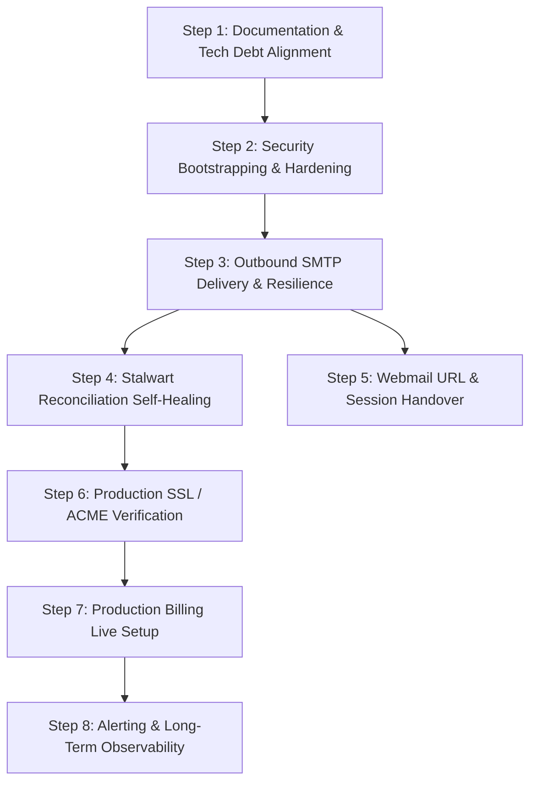

# Toowix Mail Platform — Current Work Map

**Document Purpose:** Complete, dependency-aware map of remaining work, gaps, and decisions required before the Toowix Mail Platform can be considered complete and production-ready.  
**Source of Truth:** Active codebase, passing test suites (675 tests), and [PROJECT_BASELINE.md](file:///c:/Users/xeon3/Desktop/toowix-mail-platform-app/toowix-mail-platform/docs/PROJECT_BASELINE.md).

---

## 1. Critical Missing Functionality

*Features directly impacting core platform capabilities that are entirely absent or non-operational.*

### 1.1 Stalwart Entity Drift Self-Healing / Auto-Repair
- **What currently exists:**
  `backend/src/services/reconciliation.service.ts` provides `checkDrift()` (which detects missing domains/mailboxes in Stalwart and orphaned entities in Stalwart) and `repairQuotaDrift()` (which corrects MongoDB `mailboxCount`).
- **What is missing:**
  There is **no automatic or administrative one-click repair** for missing or orphaned Stalwart entities. If a domain or mailbox exists in MongoDB but failed to create in Stalwart (or vice versa), the admin can only view the drift report; they cannot trigger automatic re-provisioning or purging from either the API or Super Admin UI.
- **Components involved:**
  - `backend/src/services/reconciliation.service.ts`
  - `backend/src/api/system.routes.ts` (`GET /api/system/reconciliation`)
  - `apps/super-admin/src/components/PlatformAdminDashboard.tsx`
- **Blocks production:** Yes, for unattended production operations. If network blips or Stalwart restarts cause provisioning drift, manual database surgery is currently required.
- **Dependencies:** Stalwart JMAP Client (`backend/src/stalwart/client.ts`).
- **Decisions needed:**
  - Should drift reconciliation automatically reconcile on a background schedule, or remain manual on-demand via Super Admin button?
  - Does MongoDB always win over Stalwart (e.g. purge unknown Stalwart accounts, re-create missing Stalwart accounts)?

---

## 2. Partially Implemented Functionality

*Features with working backend or frontend plumbing, but missing complete end-to-end user flows or lifecycle edges.*

### 2.1 Webmail Access & Session Handover (Bulwark)
- **What currently exists:**
  `deploy/docker-compose.dev.yml` and `prod.yml` include the Bulwark webmail container (port `8888`) with `server-proxy.js` forwarding JMAP calls to Stalwart. The Tenant Admin UI has a top navbar button linking to `http://localhost:8888`.
- **What is missing:**
  - **No automated authentication or seamless session transfer:** Clicking "Webmail" opens a generic webmail login page where the user must re-enter their full email address and Stalwart mailbox password.
  - **Hardcoded localhost URL in frontend:** `apps/tenant-admin/src/components/Navbar.tsx` hardcodes `href="http://localhost:8888"` rather than deriving the URL from environment configuration (`config.webmailUrl` / `import.meta.env.VITE_WEBMAIL_URL`).
  - **Mailbox user self-service:** End users who only own mailboxes (not tenant admins) have no dashboard to manage their own mailbox password or 2FA directly outside Stalwart's raw webmail.
- **Components involved:**
  - `apps/tenant-admin/src/components/Navbar.tsx`
  - `apps/tenant-admin/src/api.ts`
  - `deploy/bulwark/server-proxy.js`
  - `backend/src/config.ts`
- **Blocks production:** Soft block. Basic manual login works if users know their credentials, but hardcoded `localhost:8888` breaks in staging/production deployments.
- **Dependencies:** Webmail container deployment, environment configuration.
- **Decisions needed:**
  - Should the platform implement a single sign-on (SSO) ticket/token handover to Bulwark, or is standard IMAP/JMAP credential login acceptable for V1?
  - How will the webmail URL be communicated dynamically to tenant users per domain (e.g. `webmail.customerdomain.com` vs. shared `webmail.toowix.com`)?

### 2.2 Transactional Email Outbound Delivery (Production SMTP Verification)
- **What currently exists:**
  `backend/src/services/email.service.ts` features comprehensive, responsive HTML and plain-text templates for tenant activation, 2FA backup codes, password resets, and grace period notifications.
- **What is missing:**
  - When SMTP is unreachable or fails (common in local development or before production SMTP credentials are provided), it silently falls back to printing the links/OTPs to standard console output (`[EMAIL DISPATCH: SMTP OFFLINE / FALLBACK]`).
  - No dead-letter queue, retry queue, or delivery failure tracking for failed verification emails.
  - Bounce management and webhook handling for transactional email delivery status are not implemented.
- **Components involved:**
  - `backend/src/services/email.service.ts`
  - `backend/src/config.ts` (`config.smtp`)
- **Blocks production:** Yes. In production, if outbound SMTP fails or drops, account activations, OTPs, and password resets fail without recovery.
- **Dependencies:** Dedicated transactional SMTP relay (e.g., Postmark, SendGrid, Amazon SES, or Stalwart itself).
- **Decisions needed:**
  - Will production transactional email route through Stalwart's own submission port (e.g. via system domain `dhkmail.com` / `toowix.com`) or through an external third-party transactional provider?

---

## 3. Integration Gaps

*Interfaces between external services or platform layers that require configuration or completed handshakes.*

### 3.1 Stripe Production Billing Configuration & Currency Standardization
- **What currently exists:**
  `backend/src/services/billing.service.ts` and `stripe/client.ts` implement Checkout sessions, SetupIntents, payment method attachments, Billing Meter events with peak usage calculation, and raw webhook handling.
- **What is missing:**
  - Seeding in `backend/src/db/seed.ts` defines prices in Indian Rupee paise (e.g., 4900, 9900, 14900 paise for ₹49, ₹99, ₹149).
  - Stripe products and prices are created on the fly in test mode, but there is no deployment runbook/script to register the canonical Stripe Meter and Price IDs in production.
  - Tax handling, invoice PDF downloads, and customer billing address collection are minimal.
- **Components involved:**
  - `backend/src/services/billing.service.ts`
  - `backend/src/stripe/client.ts`
  - `backend/src/db/models/Plan.ts`
  - `apps/tenant-admin/src/components/BillingView.tsx`
- **Blocks production:** Yes, if monetization/billing is enabled (`ENABLE_BILLING=true`). No, if running in self-hosted or trial-only mode (`SKIP_BILLING=true`).
- **Dependencies:** Stripe live account, webhook endpoint DNS routing.
- **Decisions needed:**
  - What is the primary billing currency (INR, USD, EUR)?
  - Are fixed plans committed annually or monthly?

### 3.2 Automated SSL / ACME Certificate Provisioning for Tenant Domains
- **What currently exists:**
  `backend/src/stalwart/client.ts` accepts an optional `acmeProviderId` and includes methods to inspect TLS certificates. Stalwart Community Edition has native ACME (Let's Encrypt) support.
- **What is missing:**
  - When a customer domain's DNS is verified and activated via `domain-activation.service.ts`, there is no explicit trigger or verification confirming that Stalwart has successfully acquired an ACME certificate for `mail.customerdomain.com` or webmail endpoints.
  - End-user mail clients connecting via IMAPS (993) / SMTPS (465) may encounter self-signed or wildcard certificate mismatches if ACME automation fails silently.
- **Components involved:**
  - `backend/src/services/domain-activation.service.ts`
  - `backend/src/stalwart/client.ts`
  - Stalwart config (`/etc/stalwart/config.toml`)
- **Blocks production:** Yes. Custom domains must have valid TLS certificates to deliver and receive external email without client security warnings.
- **Dependencies:** Working DNS records (A/AAAA/CAA) pointing to the public mail server IP.
- **Decisions needed:**
  - Does Stalwart handle ACME directly via HTTP-01 / TLS-ALPN-01 challenges on port 80/443, or does a fronting reverse proxy (Nginx/Traefik) terminate TLS?

---

## 4. Security Gaps

*Security enforcement items that require tightening before exposing public endpoints.*

### 4.1 Granular Moderator Permission Boundary on Sub-routes
- **What currently exists:**
  `TENANT_MODERATOR` role is implemented with `scopedDomainIds`. In `backend/src/api/tenant.routes.ts`, moderators can only access `GET /me` and `GET /me/domains`. In `backend/src/api/mailbox.routes.ts`, `assertMailboxInModeratorScope` ensures moderators cannot create or modify mailboxes outside their assigned domains.
- **What is missing:**
  - Direct domain-level write isolation: If a moderator is given write access in future revisions, the API must strictly enforce that moderation cannot alter tenant-wide DNS credentials or billing. Currently, the code handles this by blocking moderators entirely from those routes (`requireTenantAdmin`). This needs to be maintained as an explicit regression test suite.
- **Components involved:**
  - `backend/src/auth/middleware.ts`
  - `backend/src/api/tenant.routes.ts`
  - `backend/src/api/tenant-moderator.routes.ts`
- **Blocks production:** No, current default-deny approach is secure.
- **Dependencies:** None.

### 4.2 Super Admin Initial Bootstrap & Default Credential Rotation
- **What currently exists:**
  `backend/src/db/seed.ts` seeds a default Super Admin (`admin@toowix.com` / `PlatformAdmin2026!`) if no Super Admin exists.
- **What is missing:**
  - The application does not enforce a mandatory password change on first login for the default Super Admin.
  - 2FA is not enforced by default on the initial seeded Super Admin account (`twoFactorEnabled: false`).
- **Components involved:**
  - `backend/src/db/seed.ts`
  - `backend/src/api/auth.routes.ts`
  - `apps/super-admin/src/components/PlatformAdminDashboard.tsx`
- **Blocks production:** High security risk if deployed with default credentials without an immediate manual change.
- **Dependencies:** None.
- **Decisions needed:**
  - Should the Super Admin portal force a password reset and mandatory 2FA enrollment on initial login?

---

## 5. Production-Readiness Gaps

*Operational, runtime, and deployment tooling needed to sustain a production workload.*

### 5.1 Real-Time Alerting Channels (Slack / Discord / PagerDuty)
- **What currently exists:**
  `SystemSettingsModel` stores `webhookUrl`, `alertEmail`, and `consecutiveFailureThreshold`. `alertService` (`backend/src/services/alert.service.ts`) compiles incident reports.
- **What is missing:**
  - Outage alerts trigger only on specific domain activation failures or manual checks.
  - Background sweep failures (`dns-propagation-sweep.job.ts`, `billing-grace-sweep.job.ts`) or database connection drops do not automatically dispatch webhook alerts to Slack/Discord.
- **Components involved:**
  - `backend/src/services/alert.service.ts`
  - `backend/src/jobs/dns-propagation-sweep.job.ts`
  - `backend/src/jobs/billing-grace-sweep.job.ts`
  - `backend/src/db/connection.ts`
- **Blocks production:** No, but impacts operational visibility.
- **Dependencies:** Webhook endpoints (Slack/Discord).

### 5.2 Automated Log Rotation & Storage Management
- **What currently exists:**
  MongoDB collections `audit_logs`, `admin_sessions`, and `organisation_deletions` store logs and audit events. `admin_sessions` and `rate_limit_entries` have TTL indexes for automatic cleanup.
- **What is missing:**
  - `audit_logs` does not have a TTL index or archiving job. In high-traffic environments, audit logs will grow indefinitely.
  - Stalwart's internal log files in `/var/lib/stalwart` or Docker container logs need standard log rotation policies.
- **Components involved:**
  - `backend/src/db/models/AuditLog.ts`
  - `deploy/docker-compose.prod.yml`
- **Blocks production:** No, long-term maintenance requirement.
- **Dependencies:** None.

---

## 6. Documentation Gaps

*Outdated, misleading, or missing technical documentation in the repository.*

### 6.1 Documentation Contradictions with Active Codebase
- **What currently exists:**
  - `docs/ARCHITECTURE.md` describes a PostgreSQL 15 schema, `SELECT ... FOR UPDATE` row locks, and strict 1:1 tenant-to-domain rules.
  - `docs/IMPLEMENTATION_STATUS.md` states "Phase 1: PostgreSQL Schema" and reports "43/43 tests passing".
  - `README.md` references PostgreSQL in several sections while referencing MongoDB in others.
- **What is missing:**
  - `ARCHITECTURE.md` needs to be updated or superseded to document MongoDB 7.0, Mongoose schemas, the multi-domain per tenant model, the 3-tier metered billing engine, and the 71 test suites / 675 passing tests.
  - Setup guides should clearly guide a new engineer on MongoDB setup, Stalwart dev compose, and the dual frontend apps.
- **Components involved:**
  - `docs/ARCHITECTURE.md`
  - `docs/IMPLEMENTATION_STATUS.md`
  - `README.md`
- **Blocks production:** No, but blocks developer onboarding and architectural consistency.
- **Dependencies:** [PROJECT_BASELINE.md](file:///c:/Users/xeon3/Desktop/toowix-mail-platform-app\toowix-mail-platform\docs\PROJECT_BASELINE.md).

---

## 7. Technical Debt

*Code artifacts, dead routes, or inconsistencies that should be cleaned up.*

### 7.1 Abandoned Route File: `backend/src/api/super-admin.routes.ts`
- **What currently exists:**
  `backend/src/api/super-admin.routes.ts` contains a single line of commented code (`// ========================================== // DOMAIN DELETION REQUESTS (SUPER ADMIN QUEUE)`) and unreferenced imports.
- **What is missing:**
  It is mounted in `app.ts` (`app.use('/api/super-admin', superAdminRouter);`), but handles no active endpoints because Super Admin tenant operations were relocated to `platform-tenant.routes.ts` and `system.routes.ts`.
- **Components involved:**
  - `backend/src/api/super-admin.routes.ts`
  - `backend/src/app.ts`
- **Blocks production:** No.
- **Dependencies:** None.

### 7.2 Port Configuration Alignment
- **What currently exists:**
  - `deploy/docker-compose.dev.yml` maps Stalwart admin to host port `8085:8080`.
  - `deploy/docker-compose.prod.yml` binds Stalwart admin to `127.0.0.1:${PORT_STALWART_ADMIN:-8080}:8080`.
  - Some comments in test files refer to port `8080`.
- **What is missing:**
  Explicit port documentation to avoid developer confusion between dev mode (`8085`) and production loopback (`8080`).
- **Components involved:**
  - `deploy/docker-compose.dev.yml`
  - `docs/OPERATIONAL_RUNBOOK.md`
- **Blocks production:** No.

---

## 8. Optional / Future Features

*Features referenced in discussions, types, or long-term roadmaps that are intentionally deferred from V1.*

### 8.1 Keycloak / External OIDC Identity Federation
- **Status:** Optional / Phase 2.
- **Details:** The current in-app authentication engine (Argon2id + JWT + TOTP) is robust and completely operational. The JWT payload already conforms to OIDC claim standards (`OidcAuthTokenPayload`). External SSO/Keycloak migration is a future consideration for enterprise federation.

### 8.2 Per-Mailbox Storage Quota Enforcement
- **Status:** Optional / Phase 2.
- **Details:** Quotas are currently enforced at the **seat/mailbox count** level. Per-mailbox disk storage quotas (e.g. capping a mailbox at 5 GB or 20 GB) are defined in `PlanModel.storageQuotaGb`, but Stalwart account quotas are not currently throttled per individual account via JMAP.

### 8.3 In-App Webmail Client Embedding
- **Status:** Optional / Phase 2.
- **Details:** Embedding webmail components directly inside the Toowix React frontend (rather than using the separate Bulwark container) is an optional future UX enhancement.

---

## 9. Dependency-Aware Execution Order

*The logical, dependency-ordered sequence in which these work items can be addressed:*

### Order Rationale:

1. **Step 1: Documentation & Tech Debt Alignment** *(Foundation)*
   - **Why first:** Update `docs/ARCHITECTURE.md` and clean up `super-admin.routes.ts` so all future work is aligned with MongoDB, Multi-Domain, and the actual API surface.
   - **Dependencies:** None.

2. **Step 2: Security Bootstrapping & Credentials** *(Security Baseline)*
   - **Why next:** Ensure Super Admin requires password change and 2FA on first boot; verify secret keys in `.env.production`.
   - **Dependencies:** Step 1.

3. **Step 3: Outbound SMTP Delivery & Resilience** *(Core Communications)*
   - **Why here:** Account activation, password reset, and 2FA backup codes depend on email delivery. Production SMTP credentials and failure alerting must be reliable before public users register.
   - **Dependencies:** Step 2.

4. **Step 4: Stalwart Reconciliation Self-Healing** *(Data Integrity)*
   - **Why here:** Build the backend and UI actions to fix missing/orphaned Stalwart entities on demand, guaranteeing operational autonomy.
   - **Dependencies:** Step 1.

5. **Step 5: Webmail Environment Configuration & SSO Handover** *(User Experience)*
   - **Why here:** Replace hardcoded `localhost:8888` in tenant navbar with dynamic configuration and finalize webmail login/handover flow.
   - **Dependencies:** Step 3.

6. **Step 6: Production SSL / ACME Verification for Domains** *(Mail Delivery)*
   - **Why here:** Verify Let's Encrypt certificate acquisition for mail and webmail hostnames on activated custom domains.
   - **Dependencies:** Step 4, Step 5.

7. **Step 7: Production Stripe Billing Live Setup** *(Commercialization)*
   - **Why here:** Register canonical Stripe Meters and live prices; configure webhooks with domain routing.
   - **Dependencies:** Step 3, Step 6.

8. **Step 8: Operational Alerting & Long-Term Observability** *(Sustained Operations)*
   - **Why last:** Wire background sweep failures to Slack/Discord alerts, configure Docker log rotation and audit log pruning.
   - **Dependencies:** Steps 4, 7.
